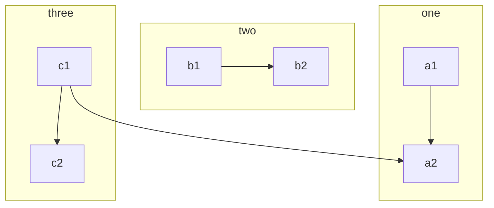
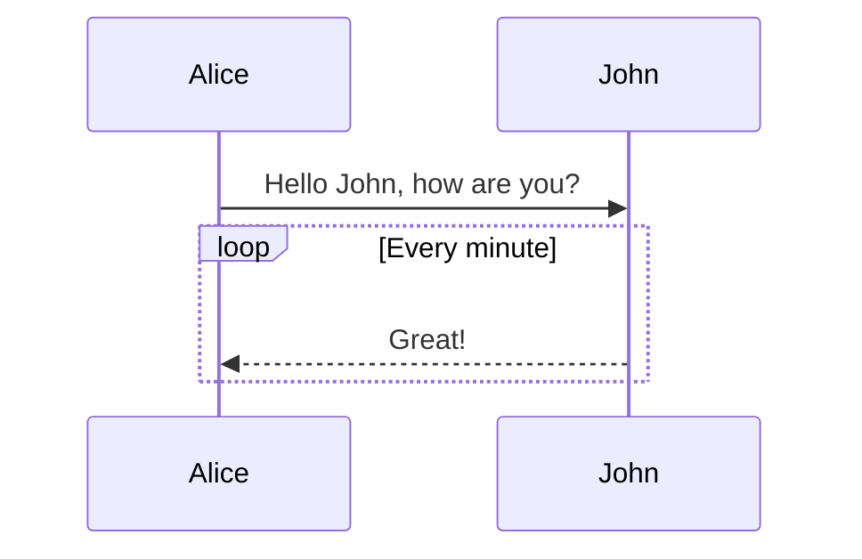
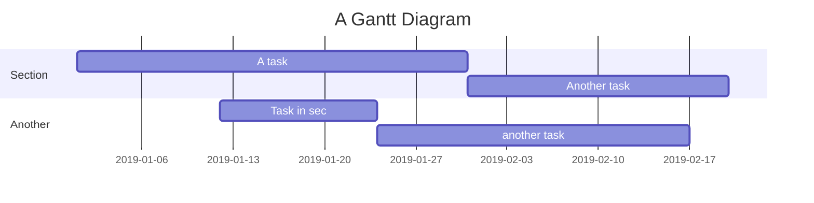
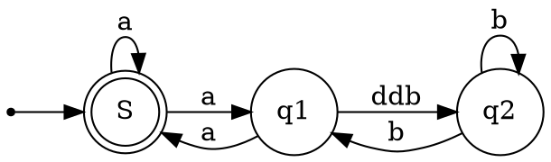

RDmark 是一款**所见即所得**编辑器，支持 *Markdown*。

* 不熟悉 Markdown 可使用工具栏或快捷键进行排版
* 熟悉 Markdown 可直接排版，也可切换为分屏预览

## 教程

这是一篇讲解如何正确使用 **Markdown** 的排版示例，学会这个很有必要，能让你的文章有更佳清晰的排版。

> 引用文本：Markdown is a text formatting syntax inspired

## 语法指导

### 普通内容

这段内容展示了在内容里面一些排版格式，比如：

- **加粗** - `**加粗**`
- *倾斜* - `*倾斜*`
- ~~删除线~~ - `~~删除线~~`
- `Code 标记` - `` `Code 标记` ``
- [超级链接](https://github.com/cedar/rdmark) - `[超级链接](https://ld246.com)`
- [username@gmail.com](mailto:username@gmail.com) - `[username@gmail.com](mailto:username@gmail.com)`

### 提及用户

@Vanessa 通过 `@User` 可以在内容中提及用户，被提及的用户将会收到系统通知。

> NOTE:
>
> 1. @用户名之后需要有一个空格
> 2. 新手没有艾特的功能权限

### 表情符号 Emoji

支持大部分标准的表情符号，可使用输入法直接输入，也可手动输入字符格式。通过输入 `:` 触发自动完成。

#### 一些表情例子

😄 😆 😵 😭 😰 😅  😢 😤 😍 😌
👍 👎 💯 👏 🔔 🎁 ❓ 💣 ❤️ ☕️ 🌀 🙇 💋 🙏 💢

### 大标题 - Heading 3

你可以选择使用 H1 至 H6，使用 ##(N) 打头。建议帖子或回帖中的顶级标题使用 Heading 3，不要使用 1 或 2，因为 1 是系统站点级，2 是帖子标题级。

> NOTE: 别忘了 # 后面需要有空格！

#### Heading 4

##### Heading 5

###### Heading 6

### 图片

```


```

支持拖拽到窗口上传到PicGo图床。

### 代码块

#### 普通

```
*emphasize*    **strong**
_emphasize_    __strong__
var a = 1
```

#### 语法高亮支持

如果在 ``` 后面跟随语言名称，可以有语法高亮的效果哦，比如:

##### 演示 Go 代码高亮

```go
package main

import "fmt"

func main() {
	fmt.Println("Hello, 世界")
}
```

##### 演示 Java 高亮

```java
public class HelloWorld {

    public static void main(String[] args) {
        System.out.println("Hello World!");
    }

}
```

> Tip: 语言名称支持下面这些: `ruby`, `python`, `js`, `html`, `erb`, `css`, `coffee`, `bash`, `json`, `yml`, `xml` ...

### 有序、无序、任务列表

#### 无序列表

- Java
  - Spring
    - IoC
    - AOP
- Go
  - gofmt
  - Wide
- Node.js
  - Koa
  - Express

#### 有序列表

1. Node.js
   1. Express
   2. Koa
   3. Sails
2. Go
   1. gofmt
   2. Wide
3. Java
   1. Latke
   2. IDEA

#### 任务列表

- [X]  任务1
- [X]  任务2
- [ ]  任务3

### 表格

如果需要展示数据什么的，可以选择使用表格。


| header 1 | header 2 |
| -------- | -------- |
| cell 1   | cell 2   |
| cell 3   | cell 4   |
| cell 5   | cell 6   |

### 隐藏细节

<details>
<summary>这里是摘要部分。</summary>
这里是细节部分。
</details>

### 段落

空行可以将内容进行分段，便于阅读。（这是第一段）

使用空行在 Markdown 排版中相当重要。（这是第二段）

### 链接引用

[链接文本][链接标识]https://b3log.org

```
[链接文本][链接标识]

[链接标识]: https://b3log.org
```

### 数学公式

多行公式块：

$$
\frac{1}{
  \Bigl(\sqrt{\phi \sqrt{5}}-\phi\Bigr) e^{
  \frac25 \pi}} = 1+\frac{e^{-2\pi}} {1+\frac{e^{-4\pi}} {
    1+\frac{e^{-6\pi}}
    {1+\frac{e^{-8\pi}}{1+\cdots}}
  }
}
$$

行内公式：

公式 $a^2 + b^2 = \color{red}c^2$ 是行内。

### 脑图

```mindmap
- 教程
- 语法指导
  - 普通内容
  - 提及用户
  - 表情符号 Emoji
    - 一些表情例子
  - 大标题 - Heading 3
    - Heading 4
      - Heading 5
        - Heading 6
  - 图片
  - 代码块
    - 普通
    - 语法高亮支持
      - 演示 Go 代码高亮
      - 演示 Java 高亮
  - 有序、无序、任务列表
    - 无序列表
    - 有序列表
    - 任务列表
  - 表格
  - 隐藏细节
  - 段落
  - 链接引用
  - 数学公式
  - 脑图
  - 流程图
  - 时序图
  - 甘特图
  - 图表
  - 五线谱
  - Graphviz
  - 多媒体
  - 脚注
- 快捷键
```

### 流程图



### 时序图



### 甘特图



### 图表

```echarts
{
  "title": { "text": "最近 30 天" },
  "tooltip": { "trigger": "axis", "axisPointer": { "lineStyle": { "width": 0 } } },
  "legend": { "data": ["帖子", "用户", "回帖"] },
  "xAxis": [{
      "type": "category",
      "boundaryGap": false,
      "data": ["2019-05-08","2019-05-09","2019-05-10","2019-05-11","2019-05-12","2019-05-13","2019-05-14","2019-05-15","2019-05-16","2019-05-17","2019-05-18","2019-05-19","2019-05-20","2019-05-21","2019-05-22","2019-05-23","2019-05-24","2019-05-25","2019-05-26","2019-05-27","2019-05-28","2019-05-29","2019-05-30","2019-05-31","2019-06-01","2019-06-02","2019-06-03","2019-06-04","2019-06-05","2019-06-06","2019-06-07"],
      "axisTick": { "show": false },
      "axisLine": { "show": false }
  }],
  "yAxis": [{ "type": "value", "axisTick": { "show": false }, "axisLine": { "show": false }, "splitLine": { "lineStyle": { "color": "rgba(0, 0, 0, .38)", "type": "dashed" } } }],
  "series": [
    {
      "name": "帖子", "type": "line", "smooth": true, "itemStyle": { "color": "#d23f31" }, "areaStyle": { "normal": {} }, "z": 3,
      "data": ["18","14","22","9","7","18","10","12","13","16","6","9","15","15","12","15","8","14","9","10","29","22","14","22","9","10","15","9","9","15","0"]
    },
    {
      "name": "用户", "type": "line", "smooth": true, "itemStyle": { "color": "#f1e05a" }, "areaStyle": { "normal": {} }, "z": 2,
      "data": ["31","33","30","23","16","29","23","37","41","29","16","13","39","23","38","136","89","35","22","50","57","47","36","59","14","23","46","44","51","43","0"]
    },
    {
      "name": "回帖", "type": "line", "smooth": true, "itemStyle": { "color": "#4285f4" }, "areaStyle": { "normal": {} }, "z": 1,
      "data": ["35","42","73","15","43","58","55","35","46","87","36","15","44","76","130","73","50","20","21","54","48","73","60","89","26","27","70","63","55","37","0"]
    }
  ]
}
```

### 五线谱

```abc
X: 24
T: Clouds Thicken
C: Paul Rosen
S: Copyright 2005, Paul Rosen
M: 6/8
L: 1/8
Q: 3/8=116
R: Creepy Jig
K: Em
|:"Em"EEE E2G|"C7"_B2A G2F|"Em"EEE E2G|\
"C7"_B2A "B7"=B3|"Em"EEE E2G|
"C7"_B2A G2F|"Em"GFE "D (Bm7)"F2D|\
1"Em"E3-E3:|2"Em"E3-E2B|:"Em"e2e gfe|
"G"g2ab3|"Em"gfeg2e|"D"fedB2A|"Em"e2e gfe|\
"G"g2ab3|"Em"gfe"D"f2d|"Em"e3-e3:|
```

### Graphviz



### Flowchart

```flowchart
st=>start: Start
op=>operation: Your Operation
cond=>condition: Yes or No?
e=>end

st->op->cond
cond(yes)->e
cond(no)->op
```

### 多媒体

支持 v.qq.com，youtube.com，youku.com，coub.com，facebook.com/video，dailymotion.com，.mp4，.m4v，.ogg，.ogv，.webm，.mp3，.wav 链接解析

https://v.qq.com/x/cover/zf2z0xpqcculhcz/y0016tj0qvh.html

### 脚注

这里是一个脚注引用[^1]，这里是另一个脚注引用[^bignote]。

```
这里是一个脚注引用[^1]，这里是另一个脚注引用[^bignote]。
[^1]: 第一个脚注定义。
[^bignote]: 脚注定义可使用多段内容。

    缩进对齐的段落包含在这个脚注定义内。

    ```
    可以使用代码块。
    ```

    还有其他行级排版语法，比如**加粗**和[链接](https://b3log.org)。
```

## 快捷键


### 通用


| 名称           | 快捷键               | 备注              |
| -------------- | -------------------- | ----------------- |
| 表情           | :/⌘ E               |                   |
| 标题           | Ctrl H/⌘ H          | 参见下文          |
| 粗体           | Ctrl B/⌘ B          |                   |
| 斜体           | Ctrl I/⌘ I          |                   |
| 删除线         | Ctrl S/⌘ S          |                   |
| 链接           | Ctrl K/⌘ K          | 参见下文          |
| 无序列表       | Ctrl L/⌘ L          | 参见下文          |
| 有序列表       | Ctrl O/⌘ O          | 参见下文          |
| 任务列表       | Ctrl J/⌘ J          | 参见下文          |
| 引用           | Ctrl ;/⌘ ;          | 参见下文          |
| 分割线         | Ctrl Shift H/⌘ ⇧ H |                   |
| 代码块         | Ctrl U/⌘ U          | 参见下文          |
| 代码           | Ctrl G/⌘ G          |                   |
| 元素前插入空块 | Ctrl Shift B/⌘ ⇧ B | wysiwyg & ir 模式 |
| 元素后插入空块 | Ctrl Shift E/⌘ ⇧ E | wysiwyg & ir 模式 |
| 表格           | Ctrl M/⌘ M          | 参见下文          |
| 撤销           | Ctrl Z/⌘ Z          |                   |
| 重做           | Ctrl Y/⌘ Y          |                   |
| 隐藏编辑器     | Ctrl P/⌘ P          | sv 模式           |
| 全屏           | Ctrl '/⌘ '          |                   |
| 向上移动块元素 | Ctrl Shift U/⌘ ⇧ U | wysiwyg & ir 模式 |
| 向下移动块元素 | Ctrl Shift D/⌘ ⇧ D | wysiwyg & ir 模式 |
| 移除当前元素   | Ctrl Shift X/⌘ ⇧ X | wysiwyg 模式      |
| At 用户        | @                    |                   |
| 错误输入       | Backspace            |                   |

### 标题 Ctrl H / ⌘ H


| 名称     | 快捷键                                 |
| -------- | -------------------------------------- |
| 变大     | Ctrl +/⌘ +                            |
| 变小     | Ctrl -/⌘ -                            |
| H1-H6    | Ctrl Alt 1/2/3/4/5/6/⌘ ⌥ 1/2/3/4/5/6 |
| 弹出菜单 | Ctrl H/⌘ H                            |

### 链接 Ctrl K / ⌘ K


| 名称                 | 快捷键             |
| -------------------- | ------------------ |
| 输入框和元素之间切换 | Alt Enter/⌥ Enter |
| 输入框之间切换       | Tab                |

### 列表 Ctrl L/O/J / ⌘ L/O/J


| 名称               | 快捷键                                              | 备注                                                     |
| ------------------ | --------------------------------------------------- | -------------------------------------------------------- |
| 缩进               | Tab<br/>Ctrl Shift I/⌘ ⇧ I                        | Tab: 光标需位于开头                                      |
| 反向缩进           | Shift Tab/⇧ Tab<br/>Ctrl Shift O/⌘ ⇧ O<br/>Enter | Shift Tab/⇧ Tab: 光标需位于开头<br/>Enter: 需为空列表项 |
| 完成和待办之间切换 | Ctrl Shift J/⌘ ⇧ J                                | 任务列表                                                 |

### 引用 Ctrl ; / ⌘ ;


| 名称                 | 快捷键                      | 备注                                                           |
| -------------------- | --------------------------- | -------------------------------------------------------------- |
| 在顶层引用前插入空块 | Ctrl Alt Enter/⌘ ⌥ Enter  | wysiwyg 模式                                                   |
| 在顶层引用后插入空块 | Alt Enter/⌥ Enter          | wysiwyg 模式                                                   |
| 插入块元素           | Ctrl Shift :/⌘ ⇧ :<br/> > | Ctrl Shift :/⌘ ⇧ :: 块元素变为引用<br/>>: 内联元素中插入引用 |
| 引用和块元素之间切换 | Ctrl ;/⌘ ;                 |                                                                |

### 代码块 Ctrl U / ⌘ U


| 名称                   | 快捷键             |
| ---------------------- | ------------------ |
| 输入框和代码块之间切换 | Alt Enter/⌥ Enter |
| 隐藏编辑界面           | Escape             |
| 选中所有代码           | Ctrl A/⌘ A        |

### 表格 Ctrl M / ⌘ M


| 名称                   | 快捷键                         |
| ---------------------- | ------------------------------ |
| 在上方插入一行         | Ctrl +/⌘ ⇧ F                 |
| 在下方插入一行         | Ctrl +/⌘ +                    |
| 删除行                 | Ctrl -/⌘ -                    |
| 在左边插入一列         | Ctrl Shift +/⌘ ⇧ G           |
| 在右边插入一列         | Ctrl Shift +/⌘ ⇧ +           |
| 删除列                 | Ctrl Shift -/⌘ ⇧ -           |
| 左对齐                 | Ctrl Shift L/⌘ ⇧ L           |
| 中对齐                 | Ctrl Shift C/⌘ ⇧ C           |
| 右对齐                 | Ctrl Shift R/⌘ ⇧ R           |
| 光标移动到输入框中     | Alt Enter/⌥ Enter             |
| 输入框之间切换         | Tab                            |
| 将光标移动到上一个元素 | Shift Tab/⇧ Tab<br/>Backspace |
| 将光标移动到下一个元素 | Tab                            |

[^1]: 第一个脚注定义。
    
[^bignote]: 脚注定义可使用多段内容。
    
    缩进对齐的段落包含在这个脚注定义内。
    
    ```
    可以使用代码块。
    ```
    
    还有其他行级排版语法，比如**加粗**和[链接](https://b3log.org)。
